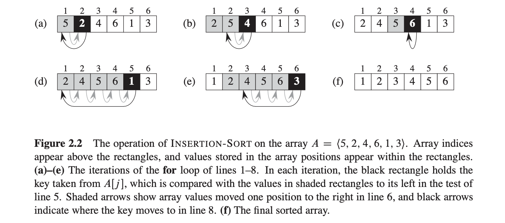

# Sorting Algorithms

                        start
                        indexing_length (until end of list)
                           ⤵️
            list_a = [ 31, 41, 59, 26, 41 ]
    indexing_length = range(1, len(list_a))

    initiate for loop for indexing_length
    set var

                                            list_a[i] @ beginning of while loop
                                               ⤵️
                        list_a = [ 31, 41, 59, 26, 41 ]
                                           ⤴️
                                list_a[i-1] @ beginning of while loop

        i =- 1
        decrement i by one (this is how we move down the list)
